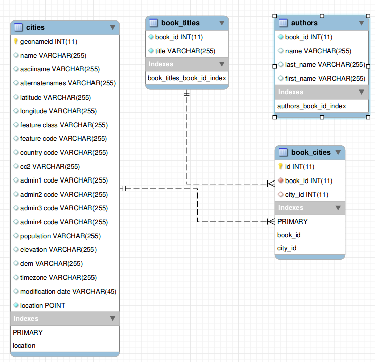
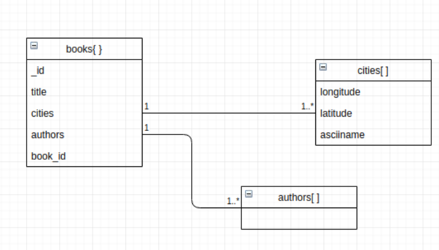

# DatabaseSemesterProject

## Links

- [Exam material](https://github.com/datsoftlyngby/soft2019spring-databases/tree/master/Exam)
- [RDF source](https://www.gutenberg.org/wiki/Gutenberg:Feeds)
- [Cities files and description](http://download.geonames.org/export/dump/)
- [FTP containing most data files](https://bit.ly/2EyCDsk)
- [Report](#report)

## Scripts

### cli.py

This is the intro point for the project to answer the given queries. Switching between databases requires going into the script and instantiating `Mysql` or `Mongo` class. Credentials need to be changed for both, unless using default settings for Mongo.
The script shows has four options, one for each question.

### main.py

Unlike the name suggests, this is not the main script. This script extracts city names from the book contents using a library called `geotext`. This library uses data from [geonames.org](http://www.geonames.org/) find city and country names in text. The extrcted names are then further filtered based on the provided `cities5000.txt` file(see link in links section).

### parse_rdfs.py

This script extracts information about the books from the offline catalog. Change `bookFolder` variable inside it to point it to the RDF folder. It will produce two files `authors.csv` and `titles.csv`.

# MySQL

# Importing data

Obviusly all the the files mentioned in the SQL queries need to be on your system.

## Titles

```
CREATE TABLE `book_titles` (
  `book_id` int(11) NOT NULL,
  `title` varchar(255) NOT NULL
) ENGINE=InnoDB DEFAULT CHARSET=utf8mb4 COLLATE=utf8mb4_0900_ai_ci;
```

```
load data local infile '/work/soft2019spring-databases/exam/titles.csv' into table book_titles COLUMNS terminated by '"';
```

## Book cities

```
CREATE TABLE `book_cities` (
  `id` int auto_increment not null,
  `book_id` int(11) NOT NULL,
  `city_id` int(11) NOT NULL,
  primary key (id)
) ENGINE=InnoDB DEFAULT CHARSET=utf8mb4 COLLATE=utf8mb4_0900_ai_ci;
```

```
load data local infile '/work/soft2019spring-databases/exam/book_cities.csv' into table book_cities fields terminated by ',' (book_id, city_id);
```

Given that this is the largest file, it also takes forever to import:
```
Query OK, 1662465 rows affected, 706 warnings (34 min 56.14 sec)
Records: 1662466  Deleted: 0  Skipped: 1  Warnings: 706
```

## Authors

```
CREATE TABLE `authors` (
  `book_id` int(11) NOT NULL,
  `name` varchar(255) DEFAULT NULL,
  `last_name` varchar(255) DEFAULT NULL,
  `first_name` varchar(255) DEFAULT NULL
) ENGINE=InnoDB DEFAULT CHARSET=utf8mb4 COLLATE=utf8mb4_0900_ai_ci;
```

```
load data local infile '/work/soft2019spring-databases/exam/authors.csv' into table authors fields terminated by ',' enclosed by '"';
```

## Cities

```
CREATE TABLE `cities` (
  `geonameid` int(11) NOT NULL,
  `name` varchar(255) DEFAULT NULL,
  `asciiname` varchar(255) DEFAULT NULL,
  `alternatenames` varchar(255) DEFAULT NULL,
  `latitude` varchar(255) DEFAULT NULL,
  `longitude` varchar(255) DEFAULT NULL,
  `feature class` varchar(255) DEFAULT NULL,
  `feature code` varchar(255) DEFAULT NULL,
  `country code` varchar(255) DEFAULT NULL,
  `cc2` varchar(255) DEFAULT NULL,
  `admin1 code` varchar(255) DEFAULT NULL,
  `admin2 code` varchar(255) DEFAULT NULL,
  `admin3 code` varchar(255) DEFAULT NULL,
  `admin4 code` varchar(255) DEFAULT NULL,
  `population` varchar(255) DEFAULT NULL,
  `elevation` varchar(255) DEFAULT NULL,
  `dem` varchar(255) DEFAULT NULL,
  `timezone` varchar(255) DEFAULT NULL,
  `modification date` varchar(45) DEFAULT NULL,
  PRIMARY KEY (`geonameid`)
) ENGINE=InnoDB DEFAULT CHARSET=utf8mb4 COLLATE=utf8mb4_0900_ai_ci;
```

```
load data local infile '/work/soft2019spring-databases/exam/cities5000.txt' into table cities character set utf8mb4 fields terminated by '\t';
```

## Foreign keys, indexes & fixes

```sql 
update authors set last_name = null where last_name = '';
update authors set first_name = null where first_name = '';
clea
create unique index book_titles_book_id_index on book_titles(book_id);
-- TODO give authors a primary key?
create index authors_book_id_index on authors(book_id);

alter table book_cities add foreign key (book_id) references book_titles(book_id) on delete cascade;
alter table book_cities add foreign key (city_id) references cities(geonameid) on delete cascade;

alter table cities add column `location` POINT;
update cities set `location` = ST_GeomFromText(CONCAT('POINT(', latitude, ' ', longitude, ')'), 4326);
alter table cities change location location point not null, add spatial index(location);
```

## Exporting as JSON(input for mongo)

```sql
select 
    json_object(
        'book_id', book_titles_with_authors.book_id, 
        'title', book_titles_with_authors.book_title,
        'cities', json_arrayagg(json_object(
            'name',  cities.asciiname,
            'location', json_object(
                'type', 'Point',
                'coordinates', json_array(st_y(cities.location), st_x(cities.location))
            )
        )),
        'authors', book_titles_with_authors.authors,
        'authors_org', book_titles_with_authors.authors_org
    ) as book_data 
from 
    (
        select 
            book_titles.book_id as book_id,
            book_titles.title as book_title,
            json_arrayagg(authors.name) as authors_org, 
            if(group_concat(first_name) is not null and group_concat(last_name) is not null, json_arrayagg(concat(authors.first_name,' ', authors.last_name)), 
            json_arrayagg(authors.name)) as authors 
        from 
            book_titles 
        left join authors on authors.book_id = book_titles.book_id 
        group by book_titles.book_id
    ) as book_titles_with_authors 
left join 
    book_cities on book_cities.book_id = book_titles_with_authors.book_id 
left join 
    cities on cities.geonameid = book_cities.city_id 
group by 
    book_titles_with_authors.book_id 
into outfile '/var/lib/mysql-files/book_data5';
```

#SQL

## Queries

1. ```sql
    SELECT * FROM book_titles INNER JOIN authors ON book_titles.book_id = authors.book_id
    INNER JOIN book_cities ON book_cities.book_id = book_titles.book_id INNER JOIN cities ON cities.geonameid = book_cities.city_id 
    WHERE cities.asciiname = ?;
    ```
2. ```sql
    SELECT * FROM book_titles INNER JOIN book_cities ON book_titles.book_id = book_cities.book_id INNER JOIN cities ON cities.geonameid = book_cities.city_id WHERE book_titles.title = ?;
    ```
3. ```sql
    SELECT * FROM authors INNER JOIN book_titles ON authors.book_id = book_titles.book_id INNER JOIN book_cities ON book_cities.book_id = authors.book_id
    INNER JOIN cities ON cities.geonameid = book_cities.city_id WHERE authors.name = ? OR authors.first_name = ?;

4. ```sql
    SELECT distinct(cities.asciiname), title, ST_Distance(cities.location, ST_GeomFromText(?, 4326)) as distance FROM cities INNER JOIN book_cities ON cities.geonameid = book_cities.city_id INNER JOIN book_titles ON book_titles.book_id = book_cities.book_id having distance <= ?;
    ```


# MongoDB

## Importing data

To import data use the query from MySQL section to generate a mysql dump. Then use some text editor to replace `\\"` characters to `\"` and finally run command below, changing database, collection and file names as necessary. 
```bash
mongoimport --db db_exam --collection books --file soft2019spring-databases/exam/book_data5
```


## Indexes, cleanup etc

```
db.books.updateMany( { "cities.0.name": { $type: 10 }, cities: { $size: 1 } },  { $set: { cities: [] } })

db.books.createIndex({"cities.location": '2dsphere'})
```

## Queries

1. 
```json
{ "cities":  {
        "$elemMatch": {"name": city_name } 
    } 
}
```

2. 
```json
{'title': book_titles}
```

3. 
```json
{'authors': author}
```

4. 
```json
{
    "cities.location": { 
        '$near': { 
            $geometry: { 
                type: 'Point', 
                coordinates: [55.67594, 12.56553]
            }, 
            '$maxDistance': 5000 
        } 
    }  
}
```


# Benchmarking


| Query type | value | Mongo app | MySQL app | Mongo shell | MySQL shell |
|------------|-------|-------|-------|-------|-------|
| Book titles by city name | Bonn | 0 | 267 MS | 0 | 80MS 
| Book titles by city name | Tainan | 0 | 235MS | 0 | 60MS |
| Book titles by city name | Managua | 0 | 197MS | 0 | 50MS |
| Book titles by city name | ThisDoesntExist | 0 | 50 MS | 0 | 50MS |
| Cities by book title |Galatians||396MS|0|50MS |0|
| Cities by book title |The New Germany|1MS|93MS|0|70MS |
| Cities by book title |The Black Box|0|305MS|0|50MS|
| Cities by book title |Apologia Pro Vita Sua|0|340MS|0|70MS|
| Cities by book title |Not Paul, But Jesus|0|204MS|0|40MS|
| Books by author |James R. Sullivan |0|1365MS|0|70MS|
| Books by author |Charles Darwin |0|21MS|0|80MS|
| Books by author |John Ireland|0|166MS|0|50MS|
| Books by author |Rosa Luxemburg |0|66MS|0|50MS|
| Books by author |Norman Duncan |0|772MS|0|70MS|
| Books by coordinates | 35.381288 -89.967356|-|21123MS|-|19.56S|
| Books by coordinates | 19.475110 -98.988092 |-|19282MS|-|19.68S|
| Books by coordinates | 45.801695 15.709844 |-|19673MS|-|19.68S|
| Books by coordinates | 52.512958 13.651552 |-|19900MS|-|19.15S|
| Books by coordinates | 50.054757 19.271203 |-|19547MS|-|19.16S|


# Report

We used MySQL and MongoDB as our database choices because we thought that we had the best insight on how to work with these two. It would make our pace of finishing the project faster and give us a better understanding on what had to be done.

## Data modelling

### MySQL

We decided to have 4 tables: authors, book_cities, book_titles and cities. The reason behind the book_cities table is because we have one to many relationship. Between book and cities. The book_id column is used as an index in all the tables, Except cities because we query by it a lot. The schema is relatively normalized with the exceptions of authors which does not have a primary key. Candidates for such key can be either a composite key of book_id and name, since an author can appear multiple times in the table, but not for the same book, or adding a new auto-incremented key with sole purpose of being a primary key, which is the preferred option to avoid using a VARCHAR column as a key.


### MongoDB
When it comes to mongo, we decided to use only 1 document to store data because we exported the data from mysql and just stored it in the mongo database. This approach does include a lot of redundant data, especially in the case of cities. The cities array contains the list of city names and their geo location in GeoJSON format. This could be moved to its own document, but for this project it provided an easy way to find all books by a name of a city but also prevented properly implementing the geo search. The $geoNear aggregation in MongoDB when having an array of locations, will return the closest distance to the given point, but will not give results about which of the array elements matched it. With some extra options, it can provide the coordinates that were used to find the nearest match, but that still requires processing at the application level to find which location name was it. In normal aggregation pipelines the solution would be to $unwind the cities array, but the $geoNear aggregation pipeline must appear first. Because of this, we could never get the results from Mongo to match MySQL which we considered to be correct.


### Application

We haven’t done data modeling in our application because we decided to use simple CLI which only outputs the result of the queries. We did some string formatting where we print new lines just to make it a bit more readable but that is about it. However, if we had more time we would have our front end client take care of data formatting, perhaps have it as a JSON format which is quite readable.

## Importing data
Importing data into MySQL consists of a few separate processes: extracting city names from Gutenbergs book files, extracting the titles and author names from RDF files and finally loading all that into a MySQL database.  

The first step is accomplished using a Python library called “GeoText”, which uses data from “geonames.org” to match city and country names in text, that list is further filtered using a provided list of city names(“cities5000.txt” file). Given the 30764 book folders downloaded from project Gutenberg, the script takes over 24 hours to go through all of them. Because the script is single-threaded, the bottleneck ends up being file I/O, especially if it involves a HDD. As seen in the MySQL ERP diagram, the relation between books(book_titles) and cities is a many-to-many, therefore the script only outputs two values in a CSV format: book ID and geonameid(called city_id in the join table). The resulting file contains 1662466 rows. 

Extracting book author names and titles from the RDFs files is considerably faster and involves loading an XML file and searching for predefined tag names. This script outputs two files corresponding to book_titles and authors tables. Both files use CSV format and have a “bookId” value and output 59497-59757 rows. Both numbers are larger than the number of books downloaded, which implies that either the RDF catalog may contain more or duplicate data, or not all books were downloaded.

Finally, when all four files are present(3 generated ones and 1 provided), they can be loaded into MySQL using simple `LOAD DATA LOCAL INFILE` statements, see README section on importing for them. After importing data, slight modifications are made using SQL queries to  convert author name empty string to null values and to add and populate a spatial column for city locations based on their coordinates. Finally indexes and foreign keys are added to speed up querying and enforce relationships.

Importing data into MongoDB relies on having imported data into MySQL. Data is prepared for use in Mongo by using MySQL JSON capabilities, see used query in the README.md file. The query performs relatively quickly given that it only needs to be run once and finished in 1-2 minutes. The generated data dump is ready to be imported into Mongo using the provided `mongoimport` command line tool. 

## Conclusions

After careful discussion, we would recommend the MongoDB for this project if it would ever be done in production environment. The reasoning behind that is because our schema is pretty flexible thus Mongo is a perfect fit. Moreover, mongo’s format is JSON which is one of the most wide spread formats and thgooat makes it more accessible to all the programmers coming from different backgrounds. In addition, our data is pretty location based so mongo will greatly help in storing geospatial data. 


